# LR6
Лабораторная работа №6
# 
LR6

### 
Лабораторная работа №6

**Цель работы:** _изучение базовых возможностей системы управления версиями, опыт работы с Git Api, опыт работы с локальным и удаленным репозиторием._

**Ход работы.**

1. Был создан аккаунт на `GitHub`. Далее создана копия репозитория в личное хранилище с помощью fork _(Рис. 1)._
   
   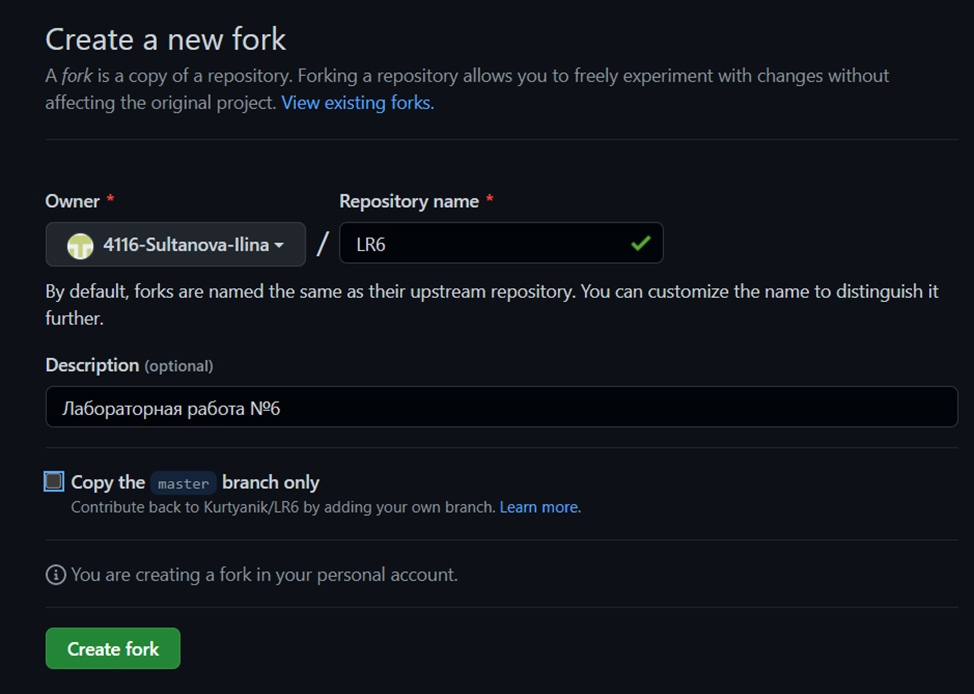

##### 
_Рисунок 1. Создание копии ._

2. Был скачан GitHub. В качестве термина был использован VS Code, в который был клонирован репозиторий с помощью команды git clone _(Рис. 2)_
   
   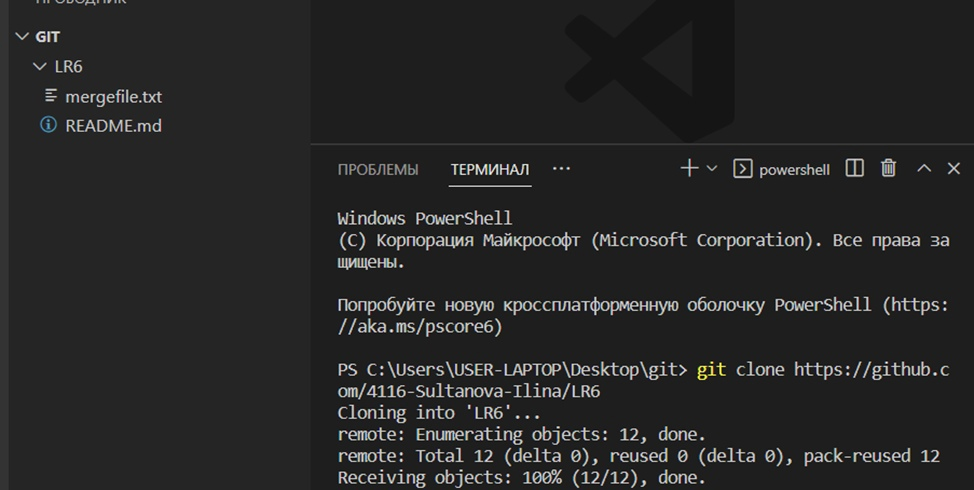

##### 
_Рисунок 2. Клонирование репозитория на локальный терминал._

3. При помощи команды `"git add ."` сделаем stage файлов. _(Рис. 3)_ 
  
   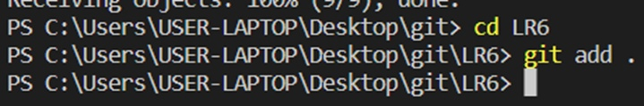

##### 
_Рисунок 3. Stage файлов._

4. Был настроен профиль _(Рис. 4)_.
 
   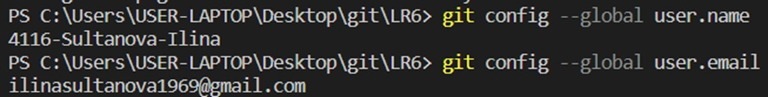

##### 
_Рисунок 4. Профиль._

5. После этого через интерфейс GitHub добавили новый файл.  _(Рис. 5)_ 
   
   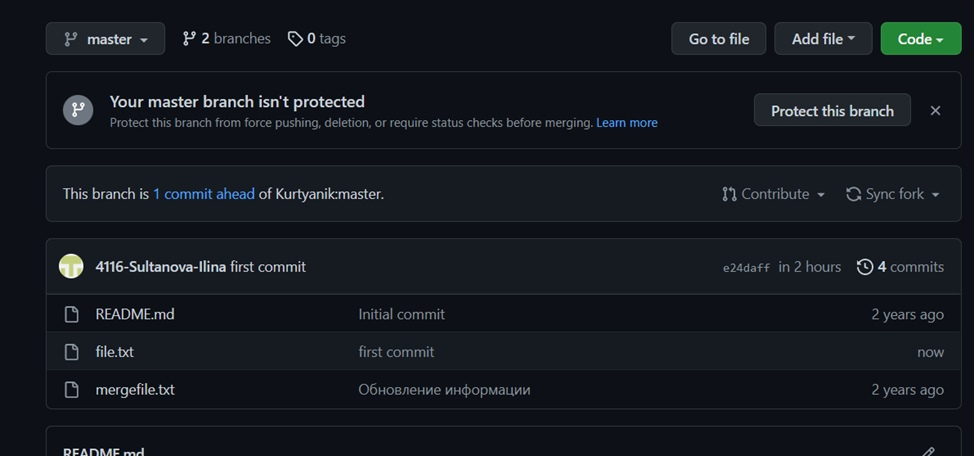

##### 
_Рисунок 5. Добавление файла._

6. Подтянули изменения в локальный репозиторий с помощью git pull. _(Рис. 6)_ 
 
   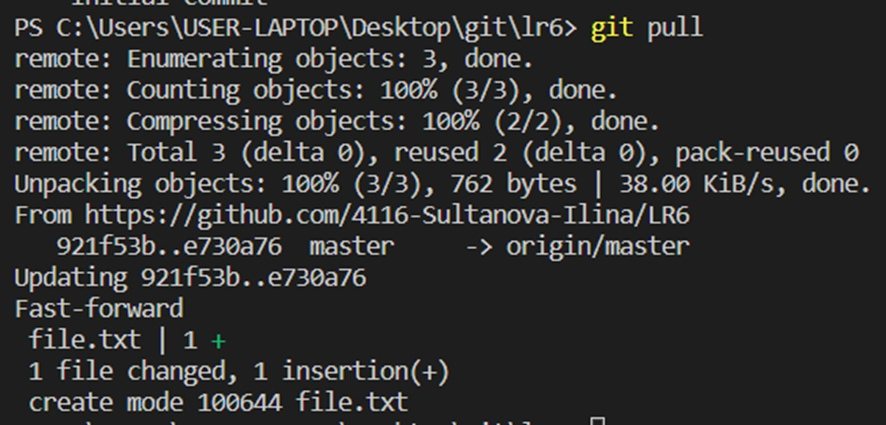

##### 
_Рисунок 6. Git pull._

7. При помощи `"git log"` запрашиваем список изменений ветки. _(Рис. 7)_
  
  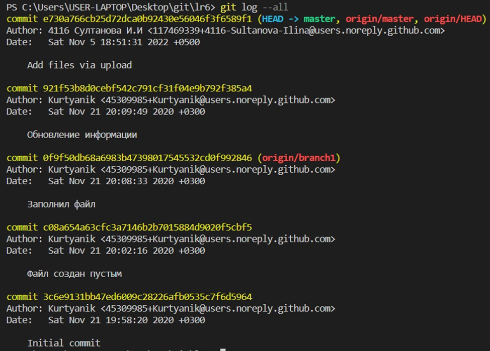

##### 
_Рисунок 7. git log._

8. Посмотрим последние изменения. _(Рис. 8)_ Для наглядности откроем их в браузере.
  
  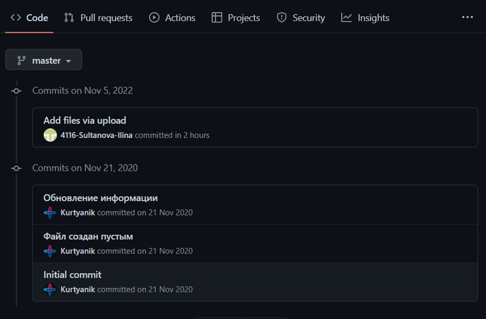

##### 
_Рисунок 8. Изменения._

9. Сошьем нашу ветку с веткой `master`. Для этого перейдем в ветку `master` при помощи `"git checkout master"`. Затем воспользуемся командой `"git merge branch1"` _(Рис. 9)_. Решим конфликт при помощи встроенного в `VS Code` инструмента Git.
  
  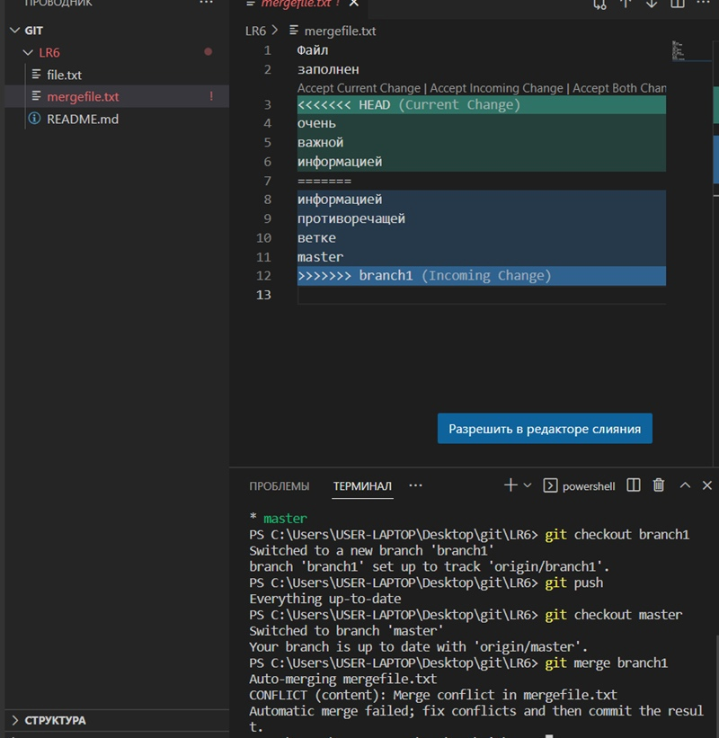

##### 
_Рисунок 9. git merge._

10. После удачного слияния удалим ненужную ветку. _(Рис. 10)_
  
  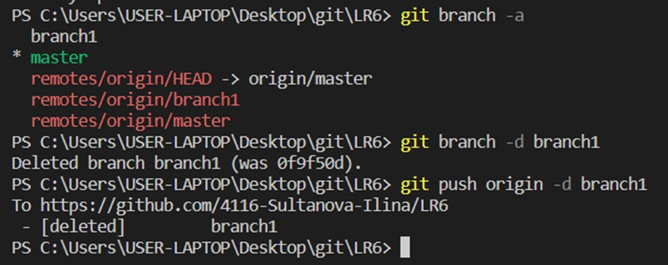

##### 
_Рисунок 10. Удаление ветки._

11. Результат слияния веток. _(Рис. 11)_
    
   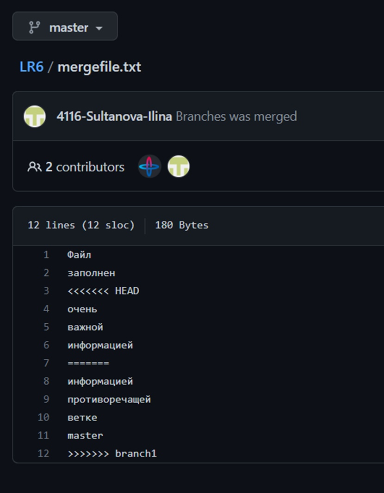

##### 
_Рисунок 11. mergefile.txt._

12. Сделали изменения в файле file.txt. _(Рис. 12)_
    
   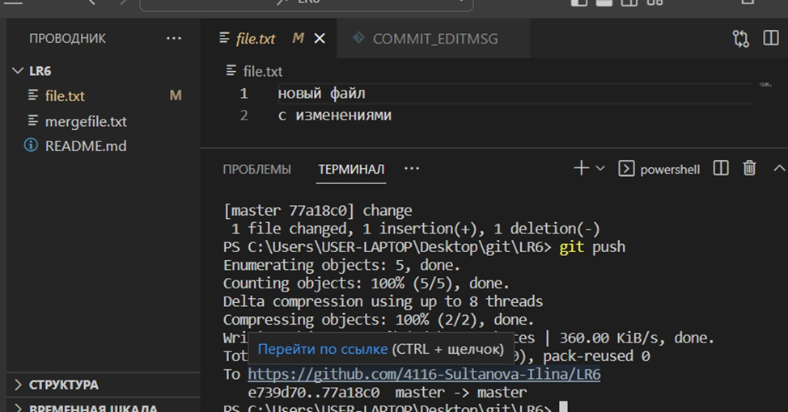

##### 
_Рисунок 12. Изменения в файле._

13. Все последние изменения. _(Рис. 13)_
   
   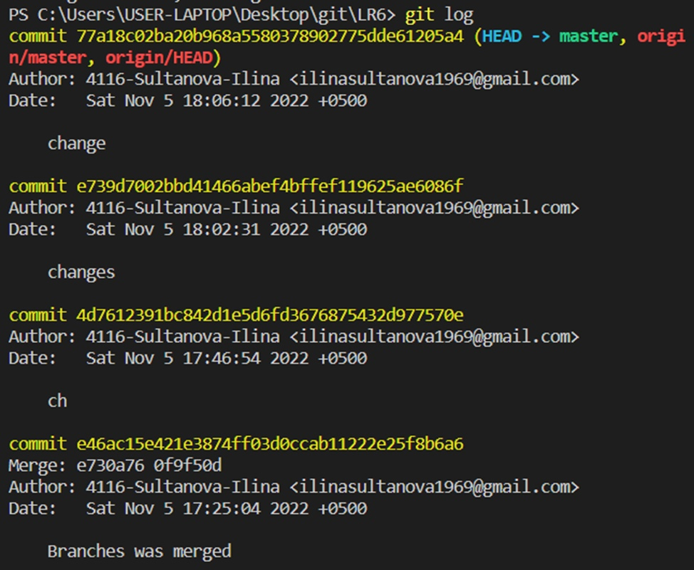

##### 
_Рисунок 13. Изменения._

14. Результат изменений. _(Рис. 14)_
   
   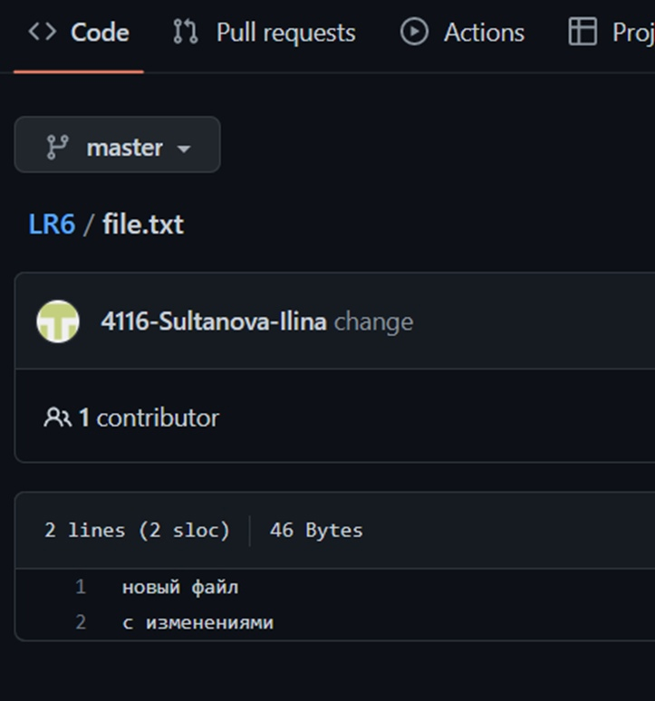

##### 
_Рисунок 14. Файл file.txt._

15. Сделам откат последнего коммита при помощи `"git revert"`._(Рис. 15)_ Данная команда создаст новый коммит без последних внесенных изменений.
   
   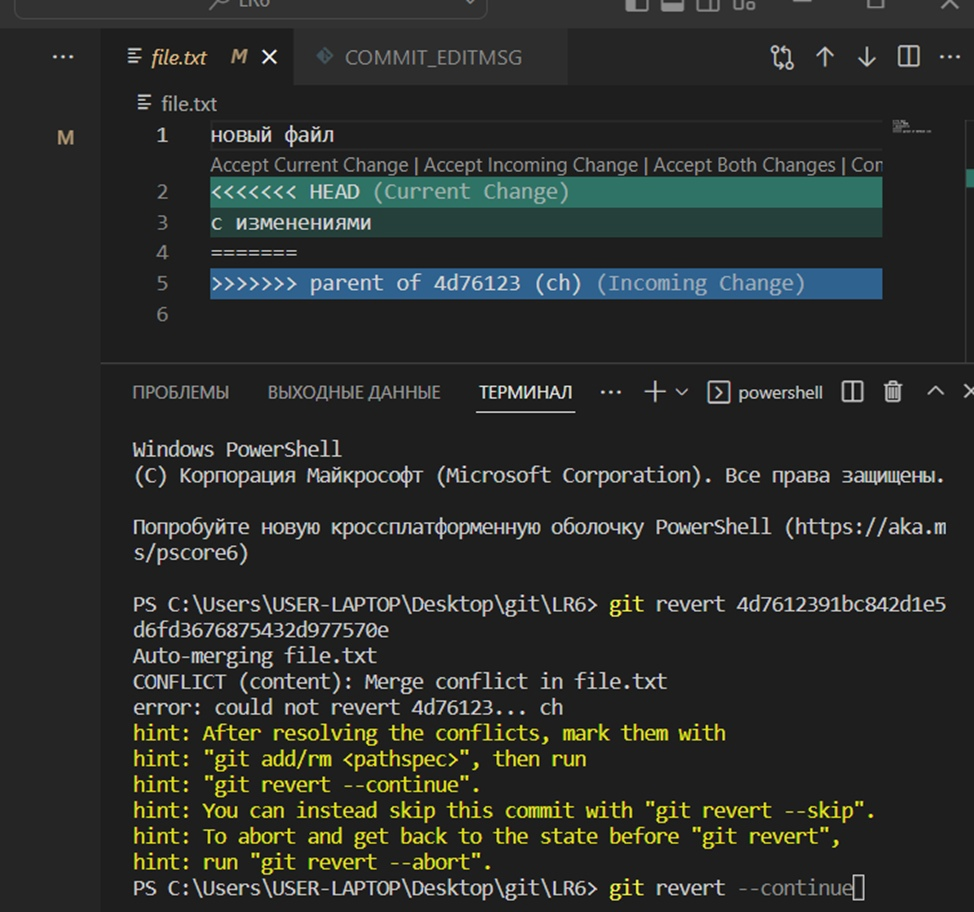

##### 
_Рисунок 15. git revert._

16. После отката удалили файл. _(Рис. 16)_
  
   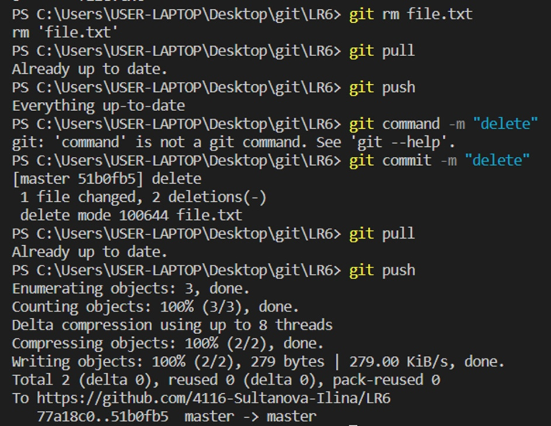

##### 
_Рисунок 16. Удаление файла._

17. Создадим новую ветку report для отчета, в которой добавим новую папку report со скриншотами. _(Рис. 17)_
   
   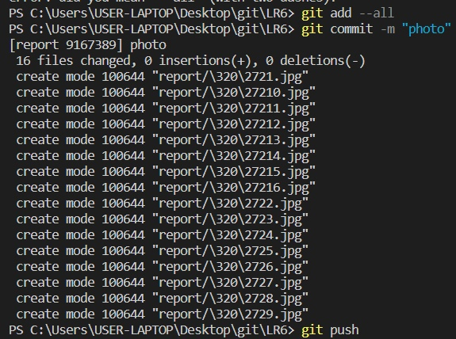

##### 
_Рисунок 18. Подтянули скриншоты в репозиторий._

18. Запросим логи в кратком формате._(Рис. 18)_ Оформим отчет.

   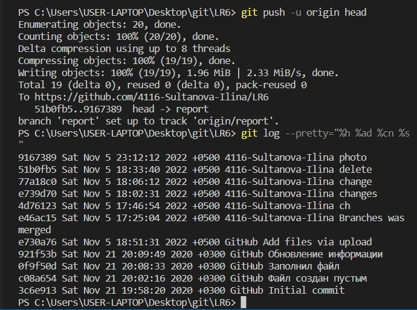

##### 
_Рисунок 18. Краткие логи._

19. Сделаем финальный коммит и зальем на GitHub.

**Вывод:** _в ходе лабоораторной работы были изучены базовые методы работы с git: git add, git commit, git clone, git log и т.д., а также был изучен синтаксис Markdown._
